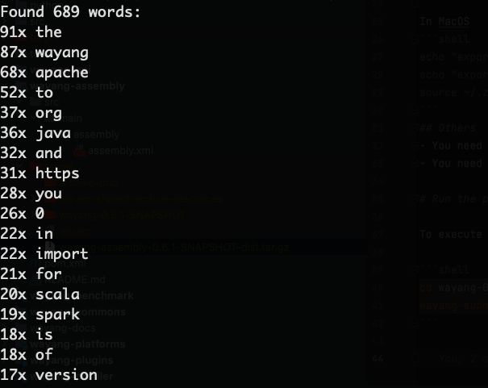

Rheem
=====

### What is Rheem?

Rheem is an efficient and scalable distributed data processing framework developed by the [data analytics](http://da.qcri.org) group at [Qatar Computing Research Institute](http://qcri.com/). It has three distinctive features:

1. it allows users to easily specify their jobs with easy-to-use interfaces,
2. it provides developers with opportunities to optimize performance in different ways, and
3. it can run on any execution platform, such as Spark or MapReduce and combinations of those.

### Download
- You can download the latest (v0.1) [from here (with spark 1.6 included)](http://rheem-qcri.s3-website-us-east-1.amazonaws.com/rheem-0.1-with-spark-1.6.0.SNAPSHOT.jar), or [here (no spark)](http://rheem-qcri.s3-website-us-east-1.amazonaws.com/rheem-0.1-SNAPSHOT.jar).
- This version v0.1 provides the platform independence feature (looping and cross-platform optimization features are coming very soon, keep tuned!)

### Source Code
- The source code can be found [here](https://github.com/daqcri/rheem)

### Prerequisites
To be able to run a Rheem application, the following software is needed:
- [Java 1.8](http://www.java.com/en/download/faq/develop.xml)
- [Apache Maven](http://maven.apache.org)
- Include the rheem jar files into your project.
- In case spark is needed; Spark (v1.6 and over), hadoop (v2.2 to v2.6.2)

### Platforms support (Rheem v0.1)
- Java (standalone JVM)
- [Apache Spark](https://spark.apache.org/)
- Coming soon: 
    - [Graphchi](https://github.com/GraphChi/graphchi-java)
    - [Postgres](http://www.postgresql.org)
    - [Torch](http://torch.ch/)
    - [Alluxio](http://www.alluxio.org/)

### Usage
- Include the rheem jar as a library in your application.
- Steps for writing a rheem application:
    1. Define a [Rheem plan](rheem-resources/docs/org/qcri/rheem/core/plan/rheemplan/RheemPlan.html) using rheem operators. For a list of all currently supported rheem operators check the [api documentation](rheem-resources/docs/org/qcri/rheem/basic/operators/package-summary.html)
    2. Create a rheem context.
    3. Register required platforms with rheem context. You might want to include an "app.properties" file in the root directory of your application to set the platform specific properties (see below). 
    4. Execute Rheem plan.
``` javascript
    # app.properties file
    spark.master = local
    spark.appName= myapp
```

# Examples

You can download the complete source of the examples from [here](http://rheem-qcri.s3-website-us-east-1.amazonaws.com/examples.zip).

### (1) UpperCase


In this simple example, we take a text file iterate through its stream of lines, perform a String UpperCase operation on each line, and output the result to standard Java output. To define a Rheem plan for this example, we (i) instantiate a new RheemPlan, (ii) create new operators instances (lines 4 to 11), (iii) connect operators together (lines 13-15), and (iv) add a sink to the RheemPlan instance. Additionally, we create a Rheem context and register the required platforms (lines 21 and 22). Notice that for this simple example we only registered the Standalone JVM platform. Finally, we execute the RheemPlan instance via the RheemContext (line 25).


```java
        // Build the RheemPlan that reads from a text file as source,
        // performs an uppercase on all characters and output to a localcallback sink

        // Create a plan
        RheemPlan rheemPlan = new RheemPlan();
        // Define the operators.
        TextFileSource textFileSource = new TextFileSource(inputFileUrl);
        MapOperator<String, String> upperOperator = new MapOperator<>(
                String::toUpperCase, String.class, String.class
        );
        LocalCallbackSink<String> stdoutSink =  LocalCallbackSink.createStdoutSink(String.class);

        // Connect the operators together.
        textFileSource.connectTo(0, upperOperator, 0);
        upperOperator.connectTo(0, stdoutSink, 0);

        // Add a sink to the rheem plan.
        rheemPlan.addSink(stdoutSink);

        // Instantiate Rheem context and register the backends.
        RheemContext rheemContext = new RheemContext();
        rheemContext.register(JavaPlatform.getInstance());

        //Execute the plan
        rheemContext.execute(rheemPlan);
```

### (2) WordCount


In this WordCount example, we first use a FlatMap operator to split each line to a set of words and then a Map operator to transform each word into lowercase and output a pair of the form (word, 1). Then, we use a ReduceBy operator to group the pairs using the word as the key and add their occurences. The operators are then connected via the connectTo() function to form a Rheem plan and the plan is executed.
Note that the same example could be done without the Map operator, however, we show here the use of the Map operator.
Also note that in this example we registered 2 platforms (lines 3-4), which means that for an optimal execution time, the Rheem optimizer will choose between the 2 platforms when executing each operator.

```java

        // Instantiate Rheem and activate the backend.
        RheemContext rheemContext = new RheemContext();
        rheemContext.register(JavaPlatform.getInstance());
        rheemContext.register(SparkPlatform.getInstance());

        TextFileSource textFileSource = new TextFileSource(inputFileUrl);

        // for each line (input) output an iterator of the words
        FlatMapOperator<String, String> flatMapOperator = new FlatMapOperator<>(
                new FlatMapDescriptor<>(line -> Arrays.asList(line.split(" ")), String.class, String.class));

        // for each word transform it to lowercase and output a key-value pair (word, 1)
        MapOperator<String, Tuple2> mapOperator = new MapOperator<>(
                new TransformationDescriptor<>(word -> new Tuple2<>(word.toLowerCase(), 1),
                        String.class,
                        Tuple2.class));

        // groupby the key (word) and add up the values (frequency)
        ReduceByOperator<Tuple2, String> reduceByOperator = new ReduceByOperator<>(
                new TransformationDescriptor<>(pair -> ((Tuple2<String, Integer>)pair).field0, Tuple2.class, String.class),
                new ReduceDescriptor<>(
                        ((a, b) -> {
                            ((Tuple2<String, Integer>)a).field1 += ((Tuple2<String, Integer>)b).field1;
                            return a;
                        }), Tuple2.class));

        // write results to a sink
        List<Tuple2> results = new ArrayList<>();
        LocalCallbackSink<Tuple2> sink = LocalCallbackSink.createCollectingSink(results, Tuple2.class);

        // Build Rheem plan by connecting operators
        textFileSource.connectTo(OUTPUT0, flatMapOperator, INPUT0);
        flatMapOperator.connectTo(OUTPUT0, mapOperator, INPUT0);
        mapOperator.connectTo(OUTPUT0, reduceByOperator, INPUT0);
        reduceByOperator.connectTo(OUTPUT0, sink, INPUT0);

        // Have Rheem execute the plan and print results.
        rheemContext.execute(new RheemPlan(sink));
        System.out.println("results:" + results);
```


### License:

Unless explicitly stated otherwise all files in this repository are licensed under the Apache Software License 2.0

Copyright 2016 Qatar Computing Research Institute

Licensed under the Apache License, Version 2.0 (the "License");
you may not use this file except in compliance with the License.
You may obtain a copy of the License at

    http://www.apache.org/licenses/LICENSE-2.0

Unless required by applicable law or agreed to in writing, software
distributed under the License is distributed on an "AS IS" BASIS,
WITHOUT WARRANTIES OR CONDITIONS OF ANY KIND, either express or implied.
See the License for the specific language governing permissions and
limitations under the License.